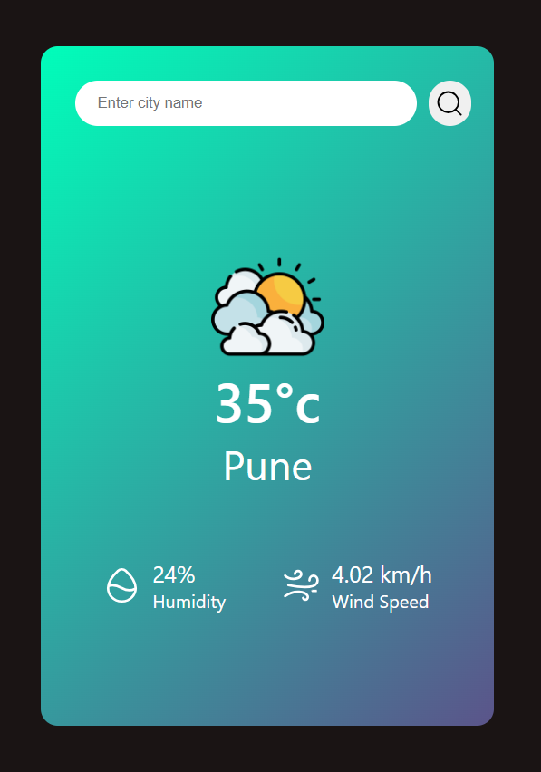

# Weather WebApp - Real-Time Weather Tracker

Weather WebApp allows users to check the real-time weather for any city. Simply enter your city's name, and get detailed weather information, including temperature, humidity, and weather conditions.

## Table of Contents
- [Preview](#preview)
- [Features](#features)
- [Technologies Used](#technologies-used)
- [Usage](#usage)
- [Deployment](#deployment)
- [Contact](#contact)
- [Acknowledgments](#acknowledgments)

---

## Preview

#### 1.

#### 2.

### Description:

To retrieve weather information for your location, simply enter the name of your city and press the 'Enter' key or click on the search button.

---

## Features

### Core Functionality:
- **City Search**: Enter a city name to retrieve its weather information.
- **Weather Details**: View temperature, humidity, weather conditions, and more.
- **Responsive Layout**: Designed to work seamlessly on all device sizes.

### Design:
- **User-Friendly Interface**: Simple and intuitive design for quick access to weather data.
- **Clear Visuals**: Large, easy-to-read display for weather information.

---

## Technologies Used
- **Frontend**: HTML, CSS, JavaScript.
- **API**: OpenWeatherMap API for fetching real-time weather data.

---

## Usage

### Using the Weather WebApp:
1. **Access the WebApp**:
   - Open the deployed application or run it locally in your browser.

2. **Search for Weather**:
   - Enter the name of your city in the search bar and press the **Enter** key or click the **Search** button.

3. **View Weather Information**:
   - The weather details for your city will appear, including temperature, humidity, and weather conditions.

---

## Deployment
The project is deployed and accessible at https://rohanbhoge.github.io/weather/

---

## Contact

Feel free to reach out to me through the following channels:

- **Email**:bhogerohan60@gmail.com
- **GitHub**: https://github.com/RohanBhoge
- **LinkedIn**: https://www.linkedin.com/in/rohanbhoge/
---

## Acknowledgments
- Thanks to **OpenWeatherMap API** for providing real-time weather data.
- Special thanks to the **web development** community for their valuable resources.
